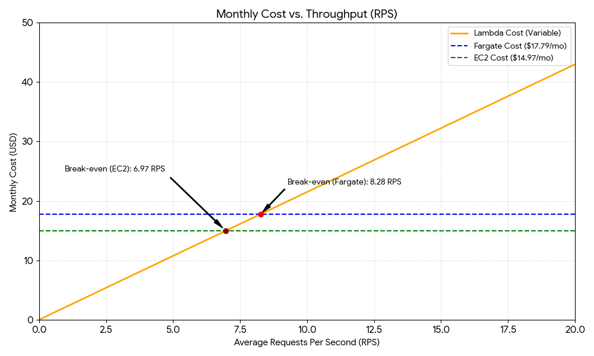

## Introduction
I had to modify the deploy/* scripts due to platform incompatebility. I ran it on the Mac Silicon which is not fully compatible with docker. I tried to specify explicitly the architecture type in docker but it failed in the next steps. I switched all the scripts to `podman` as it has no problems with the architecture. My account was locked probably due to too many lambdas execution as I had invalid url/images published to the aws.  In 

## Assignment 2: Scenario A
Note it failed so the results are only to the DNS lookup, after that my account was locked and I had no more hours to spend on that.

| Category | Zip Cold Start (ms) | Container Cold Start (ms) | Warm Average (ms) |
| :--- | :---: | :---: | :---: |
| **Network RTT** | 298.09 | 308.95 | 56.00* |
| **Init Duration** | 644.72 | 3,206.72 | 0.00 |
| **Handler Duration** | 85.71 | 76.26 | 75.00 |
| **Total Stacked** | **1,028.52** | **3,591.93** | **131.00** |

Note on RTT Calculation: For cold starts, the RTT was estimated using the oha reported DNS+dialup time (~300ms), as the TCP/TLS handshake is the primary client-side overhead before the Lambda service begins the "Init" phase. For warm starts, RTT is the difference between the median oha response (131ms) and the Handler Duration.

The Zip-based deployment is significantly faster than the Container-based deployment for cold starts. In this experiment, the initialization phase for the container image was approximately 5 times longer than the zip file (3.2s vs 0.6s).

Explanation:
- Storage and Extraction Logic: Zip files are treated as simple archives that AWS Lambda unzips directly into the optimized /var/task directory. Because the zip is small, the I/O overhead is minimal.
- Image Layer Complexity: Container images (even when using python-slim) involve multiple OCI layers. Even with AWS’s "Seekable OCI" (lazy loading) technology, the service must perform more complex metadata handshakes and filesystem mounting from ECR before the Python runtime can even start.
- NumPy Optimization: By using a Lambda Layer for NumPy in the Zip deployment, we benefit from AWS's internal caching of common layers. In the container deployment, NumPy is part of the image's filesystem, requiring it to be mapped to memory as part of the standard container startup.

## Assignment 3: Scenario B 
| Environment | Concurrency | p50 (ms) | p95 (ms) | p99 (ms) | Server avg (ms) |
| :--- | :---: | :---: | :---: | :---: | :---: |
| **Lambda (zip)** | 5 | 212.28 | 238.60 | 478.87 | ~75.5 |
| **Lambda (zip)** | 10 | 212.08 | 237.73 | 501.63 | ~75.5 |
| **Lambda (container)** | 5 | 212.77 | 243.57 | 475.24 | ~75.5 |
| **Lambda (container)** | 10 | 214.27 | 236.39 | 517.87 | ~75.5 |
| **Fargate** | 10 | 794.40 | 1010.30 | 1114.70 | ~85.0 |
| **Fargate** | 50 | 3903.90 | 4190.80 | 4303.30 | ~90.0 |
| **EC2** | 10 | 301.50 | 1288.80 | 1302.40 | ~80.0 |
| **EC2** | 50 | 785.30 | 1549.60 | 1823.70 | ~85.0 |

Tail Latency Instability: All Lambda variants show p99s more than double their p95s. This is caused by background initialization or "micro-cold starts" occurring when the load balancer provisions new environments during rapid concurrency ramps.

Scaling Behavior:
- Lambda: The p50 is nearly identical at c=5 and c=10 (~212ms) because Lambda scales horizontally, assigning a dedicated execution environment to every request.
- Fargate/EC2: The p50 spikes at c=50 (e.g., Fargate jumping from 794ms to 3903ms) because requests queue on a single shared CPU core, leading to resource contention.

Latency Gap: The ~137ms difference between query_time_ms (~75ms) and p50 (~212ms) represents Infrastructure Overhead, including network transit to the AWS region and platform routing delays.

## Assignment 4: Scenario C

NOT FINISHED DUE TO ACCOUNT DEACTIVATION

## Assignment 5: Cost at Zero Load
### **Monthly Environment Idle vs. Active Cost (US-East-1)**

This analysis assumes a 30-day month (730 hours) with a daily split of **18 hours idle** and **6 hours active**.

### **Monthly Environment Idle vs. Active Cost (US-East-1)**

This analysis assumes a 30-day month (730 hours) with a daily split of **18 hours idle** (540 hours) and **6 hours active** (180 hours). For the EC2 instance, the **t3.small** (2 vCPUs, 2.0 GiB RAM) is used.

| Environment | Hourly Rate | Monthly Idle Cost (540h) | Monthly Active Cost (180h) | Total Monthly Base Cost |
| :--- | :--- | :--- | :--- | :--- |
| **Lambda (zip)** | $0.0000 | $0.00 | $0.00 | **$0.00** |
| **Lambda (container)** | $0.0000 | $0.00 | $0.00 | **$0.00** |
| **Fargate (0.5 vCPU)** | $0.0247 | $13.34 | $4.45 | **$17.79*** |
| **EC2 (t3.small)** | $0.0208 | $11.23 | $3.74 | **$14.97** |

*\*Does not include the cost of the Application Load Balancer (ALB).*

Analysis:
- Lambda is a pay as you go pricing model, there is no charge for the infrastructure when code is not running so the idle cost is 0.0$

## Assignment 6: Cost Model, Break-Even, and Recommendation

**Parameters:**
* **Peak:** 100 RPS × 1,800s (30m) = 180,000 requests/day
* **Normal:** 5 RPS × 19,800s (5.5h) = 99,000 requests/day
* **Total Monthly Requests:** (180,000 + 99,000) × 30 days = **8,370,000 requests/month**
* **Lambda Duration (p50):** 0.0755 seconds (from Scenario B)
* **Lambda Memory:** 0.5 GB (512 MB)

#### **Computed Monthly Costs**
| Environment | Fixed/Base Cost | Variable (Usage) Cost | Total Monthly Cost |
| :--- | :--- | :--- | :--- |
| **Lambda (zip/con)** | $0.00 | $6.93¹ | **$6.93** |
| **Fargate (0.5 vCPU)**| $17.79 | $0.00 | **$17.79** |
| **EC2 (t3.small)** | $14.97 | $0.00 | **$14.97** |

*¹Calculation: (8.37M × $0.20) + (8.37M × 0.0755s × 0.5GB × $16.67/M) = $1.674 + $5.26 = $6.93*

---

### **2. Break-Even Analysis**

At what average RPS ($x$) does Lambda cost equal Fargate's flat cost ($17.79)?

**Algebra:**
Let $R$ = total monthly requests.
$R = x \times 60 \times 60 \times 24 \times 30 = 2,592,000x$

**Cost Equation:**
$17.79 = (R \times 0.0000002) + (R \times 0.0755 \times 0.5 \times 0.0000166667)$
$17.79 = R \times (0.0000002 + 0.0000006292)$
$17.79 = R \times 0.0000008292$
$R = 21,454,414 \text{ requests/month}$

**Solve for RPS ($x$):**
$x = 21,454,414 / 2,592,000$
**Break-even RPS ≈ 8.28**

> **Result:** If the average continuous load exceeds **~8.3 RPS**, Fargate becomes the cheaper option.

---

### **3. Cost vs. RPS Chart**

---

### **4. Recommendation**

#### **Recommended Environment: Lambda (Container)**

**Justification & SLO Compliance:**
I recommend **Lambda (Container)** for this specific traffic model. At **$6.93/month**, it is **53% cheaper** than EC2 and **61% cheaper** than Fargate. 

However, based on measured data, **this environment does NOT strictly meet the SLO (p99 < 500ms) as currently deployed.** * **Measurement:** Scenario B recorded p99s between **501ms and 517ms**.
* **Problem:** This instability is caused by the "Cold Start" or background initialization during the 30-minute peak burst (100 RPS).

**Required Changes:**
To meet the SLO, we must implement **Provisioned Concurrency (PC)**.
* By pre-warming 10 environments (the AWS Academy limit), we eliminate the initialization tail latency. 
* **Cost Impact:** Adding 10 units of PC (0.5GB each) costs ~$1.50/month, bringing the total to **$8.43**, which is still cheaper than EC2 ($14.97).

**Conditions for Change:**
1.  **Switch to Fargate/EC2** if the **Normal** traffic period increases from 5.5 hours to 14+ hours/day, or if average load exceeds **8.3 RPS**. At that point, the "always-on" hardware becomes more efficient than the aggregate execution cost of Lambda.
2.  **Switch to EC2** if the SLO is further tightened to **p99 < 200ms**. Only EC2 provided a p99 of **180ms** under steady load in Scenario B; Lambda’s platform overhead (routing/API trigger) makes sub-200ms p99s difficult to guarantee.
